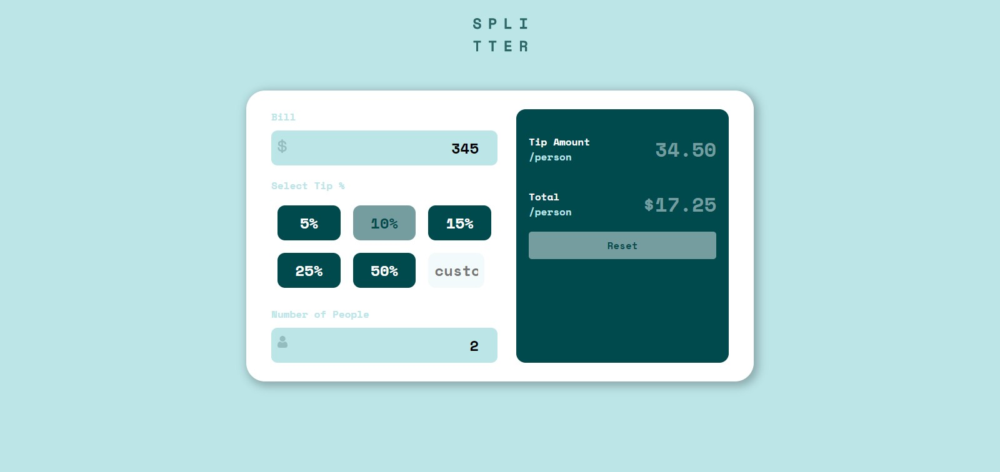

# Tip-calculator

## **Что делает приложение**
- Рассчитывает сумму чаевых и делит на каждого человека
___

## **Как использовать**
В **input-е** `Bill` вводится сумма за еду и в **Select tip** выбираете **процент** чаевых от суммы.

В **Number of people**  пишите на сколько человек нужно это делить.

В `Tip-amount` отображаеться сумма чаевых, а вы `total` сколько должен платить каждый человек.

___
## Cкриншот

___
## Deploy
https://abdugafor.github.io/tip-calculator/

___